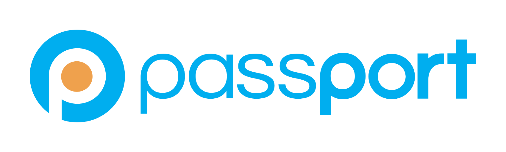
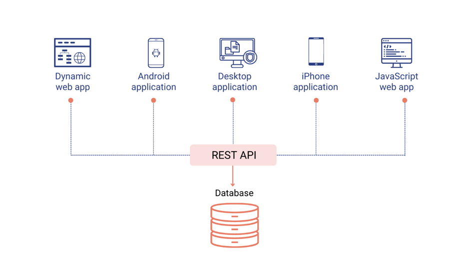
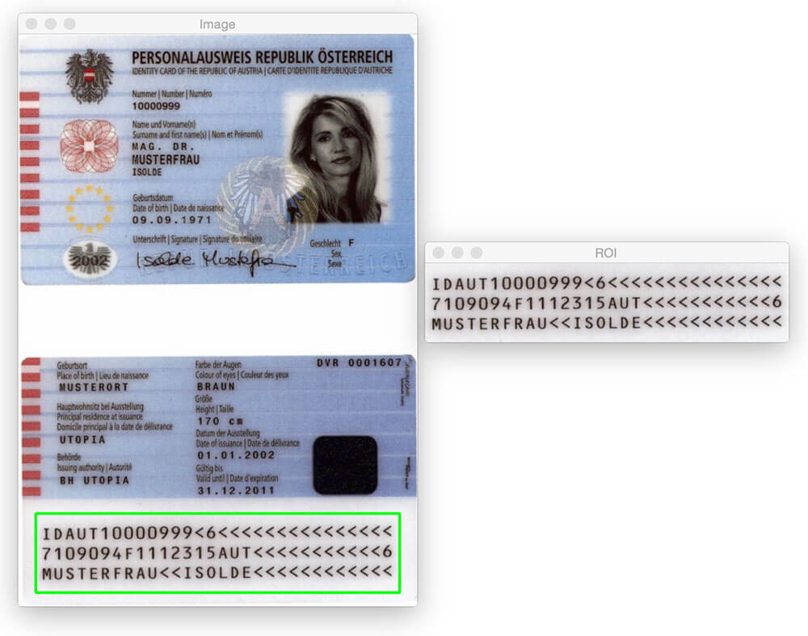
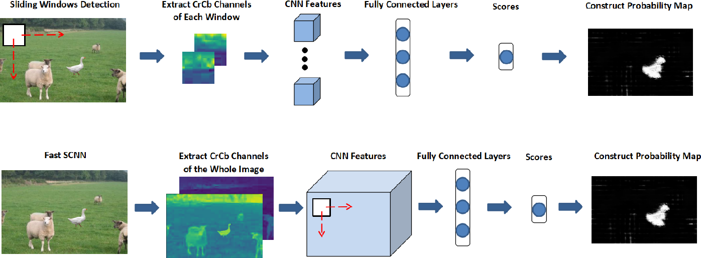

<a name="readme-top"></a>

<!-- PROJECT LOGO -->
<br />
<div align="center">
  <a href="https://github.com/kudzaiprichard/realestate-backend">
    
  </a>

  <h3 align="center">Passport Verification Api</h3>

  <p align="center">
    A restful Api for verifying passport 
    <br/>
  </p>
  <br/>
</div>

<!-- TABLE OF CONTENTS -->
<details>
  <summary>Table of Contents</summary>
  <ol>
    <li>
      <a href="#about-the-project">About The Project</a>
      <ul>
        <li><a href="#project-scope">Project Scope</a></li>
        <li><a href="#project-design">Project Design</a></li>
        <li><a href="#built-with">Built With</a></li>
      </ul>
    </li>
    <li>
      <a href="#getting-started">Getting Started</a>
      <ul>
        <li><a href="#prerequisites">Prerequisites</a></li>
        <li><a href="#installation">Installation</a></li>
        <li><a href="#contributing">Contributing</a></li>
      </ul>
    </li>
    <li><a href="#license">License</a></li>
    <li><a href="#contact">Contact</a></li>
    <li><a href="#acknowledgments">Acknowledgments</a></li>
  </ol>
</details>

<!-- ABOUT THE PROJECT -->
# About The Project

### Project Scope

The API verifies the authenticity of passports by checking against global databases, ensuring that you have access to 
accurate and up-to-date information. Integrate the API into your existing onboarding workflow to streamline your verification 
process, reduce errors, and improve your operational efficiency.

System uses a simple flask restfull api.It only stores users registration data for authentication and 
processes the passport. Then it returns the passport data and if It's valid or not. 
The passport goes through two layers of processing:

* image forgery detection 
* `passport eye` passport details verification

## Project Design

### Architecture
System uses a restfull api to share its resources. `But what is a rest API?`

<div align="center">
    
</div>

REST (Representational State Transfer) is an architectural style that defines a set of constraints for creating web services. 
REST API is a type of web service that is designed to interact with resources on the web, such as web pages, files, or other data. 
In the illustration below, we are showing how different types of applications can access a database using REST API.

### Endpoint Design
Below is a screenshot of the project restful api endpoints and the HTTP Method supported by each endpoint

| Method | resource                           |
|--------|------------------------------------|
| POST   | api/v1/auth/register               |
| POST   | api/v1/auth/authenticate           |
| POST   | /api/v1/document/validate/passport |

### How does the verification work?
What is passport Eye?

The package provides tools for recognizing machine-readable zones (MRZ) from scanned `identification documents`. 
The documents may be located rather arbitrarily on the page. The code tries to find anything resembling a `MRZ` and parse it from there.

What is MRZ?

Machine-Readable Zone `MRZ` is a codified element of identity documents. Its purpose is to `facilitate` easier automated 
scanning of basic personal details of the document holder, such as their `full name`, `document number`, `nationality`, `date of
birth`, and the document `expiration date`.

<div align="center">
    
</div>

> Above diagram shows passport Eye MRZ output

What is image forgery detection?

Image forgery detection can mainly be divided into two categories: active and passive. Sometimes these methods also give 
a localization of the altered/forged areas of the image, and even provide an estimate of the original visual content

How does image forgery work?
* `Error Level Analysis`. Manipulation attempts are detected by comparing compression quality between different areas of the image.

<div align="center">
    
</div>

* `Clone Detection`. Cloning, copying and pasting of certain objects or areas in the image is detected with scaling and rotation support.

<div align="center">
    
</div>

* `Quantization Table Analysis`. Digital cameras and PC-based image editing tools use different quantization tables when saving encoding images into JPEG 
format. Quantization tables can be extracted and analyzed. If the tables are different from those used by the camera model as specified in the image's EXIF information, then a manipulation attempt is present.


* `Double Compression Artifacts`. JPEG is a lossy compression format, meaning that certain artifacts are introduced every time an image is saved. By opening,
editing and saving a JPEG picture, one inevitably introduces compression artifacts that were not present in the original JPEG. 
As certain correlation of neighboring pixels is only present in JPEG images when they are opened and compressed again, 
it becomes possible to detect these artifacts and bring investigator's attention to the altered image.

<div align="center">
    
</div>

> Above diagram shows Double Compression Artifacts
> 
### Built With
Used `python` , `flask`, `tensorflow`, `keras` and  `Jason Web Token` to build the rest api, including `postman` for testing.

<div>
   
   
   
   
</div>

<p align="right">(<a href="#readme-top">back to top</a>)</p>

<!-- GETTING STARTED -->
## Getting Started

### Prerequisites

You should have the below software installed in your pc :
* Python3
* Anaconda
* Tesseract OCR
* and your preferred IDE or text editor


### Installation

1. Get a free API Key at [https://github.com/settings/tokens](https://github.com/settings/tokens)
2. Clone the repo

   ```sh
   git clone https://github.com/kudzaiprichard/passport-verification-api
   ```
3. Open project in desired IDE or text editor
4. Create a python environment
    ```shell
    python -m venv myenv
    ```
   
5. Activate created environment
    ```shell
    source myenv/bin/activate
    ```
   
6. Install required python packages
    ```shell
    pip install -r requirements.txt
    ```
   
7. You can now run the system using below flask command
    ```shell
    flask run
    ```

<p align="right">(<a href="#readme-top">back to top</a>)</p>

<!--CONTRIBUTING-->
## Contributing

If you have a suggestion that would make this better, please fork the repo and create a pull request. You can also simply open an issue with the tag "enhancement".
Don't forget to give the project a star! Thanks again!

1. Fork the Project
2. Create your Feature Branch (`git checkout -b feature/AmazingFeature`)
3. Commit your Changes (`git commit -m 'Add some AmazingFeature'`)
4. Push to the Branch (`git push origin feature/AmazingFeature`)
5. Open a Pull Request

### :fire: Contribution

Your contributions are always welcome and appreciated. Following are the things you can do to contribute to this project.

1. **Report a bug** <br>
   If you think you have encountered a bug, and I should know about it, feel free to report it [here]() and I will take care of it.

2. **Request a feature** <br>
   You can also request for a feature [here](), and if it will viable, it will be picked for development.

3. **Create a pull request** <br>
   It can't get better than this, your pull request will be appreciated by the community. You can get started by picking up any open issues from [here]() and make a pull request.

> If you are new to open-source, make sure to check read more about it [here](https://www.digitalocean.com/community/tutorial_series/an-introduction-to-open-source) and learn more about creating a pull request [here](https://www.digitalocean.com/community/tutorials/how-to-create-a-pull-request-on-github).

<p align="right">(<a href="#readme-top">back to top</a>)</p>

<!-- LICENSE -->
## License

> Distributed under the MIT License. See `LICENSE.txt` for more information.

<p align="right">(<a href="#readme-top">back to top</a>)</p>


<!-- CONTACT -->
## Contact

> Kudzai P Matizirofa - [linkedin.com/in/kudzai-prichard](https://linkedin.com/in/kudzai-prichard) - <kudzaiprichard@gmail.com>

Project Link: [https://github.com/kudzaiprichard/passport-verification-api](https://github.com/kudzaiprichard/passport-verification-api)

<p align="right">(<a href="#readme-top">back to top</a>)</p>

<!-- ACKNOWLEDGMENTS -->
## Acknowledgments

list of resources I found helpful and would like to give credit to.

* [Choose an Open Source License](https://choosealicense.com)
* [Image forgery detection kaggle](https://www.kaggle.com/code/vishalramanthan/image-forgery-detection)
* [Python3 documentation](https://docs.python.org/)
* [Rest API with flask](https://pythonbasics.org/flask-rest-api/)
* [Flask Documentation](https://flask.palletsprojects.com/)
* [GitHub Pages](https://pages.github.com)

<p align="right">(<a href="#readme-top">back to top</a>)</p>
